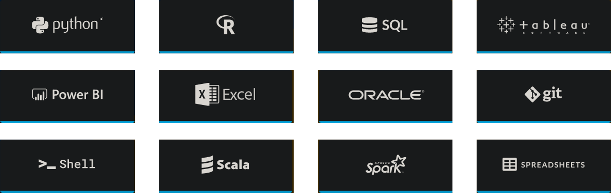
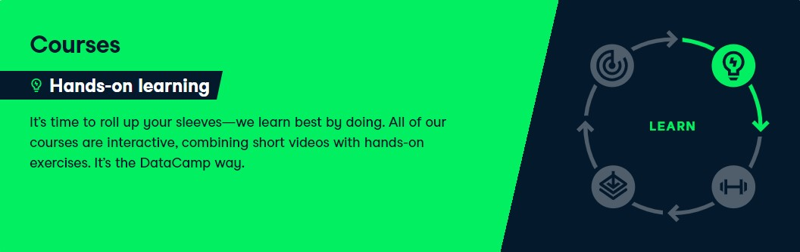
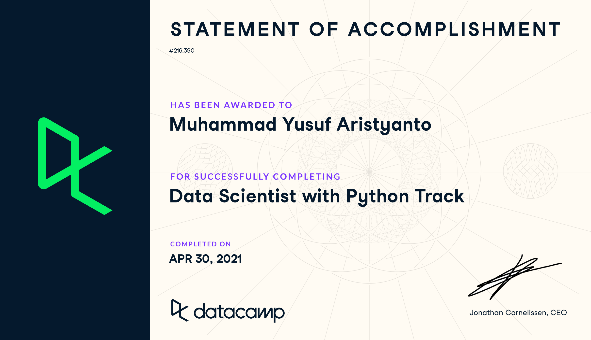

 

  

 

  <a href="https://www.datacamp.com/">Datacamp</a> is an online company that has gathered different data-related courses in one place. The provider has various classes mainly on R, Python, and SQL but also there are classes on Spreadsheets, BI, Tableau, and other topics. Those courses can be taken separately or as a set in frames of skill tracks or career tracks (read below about those formats).
  
  In a nutshell, the company includes more than <strong>340+ courses</strong> which are a combination of videos with practical assignments, over 50 curated learning paths, and more than 50 real-life projects.

 

<h1 align='center'>Learning Paths Designed by Experts</h1>

 

 

---

<h1 align="center">Courses</h1>

## 💻 Introduction

Module List

- [[📂](https://github.com/myarist/DataCamp/tree/main/Courses/Introductions/Introduction%20to%20Python)] [[🔍](https://learn.datacamp.com/courses/intro-to-python-for-data-science)] [[📃](https://www.datacamp.com/statement-of-accomplishment/course/9baefd4dba2ade2588e500c7aaa3633262f74532)] Introduction to Python

- [[❌]()] [[🔍](https://learn.datacamp.com/courses/free-introduction-to-r)] [[📃](https://www.datacamp.com/statement-of-accomplishment/course/b3e170ddd14ad89cc91ac28391ae621f29169098)] Introduction to R

- [[❌]()] [[🔍](https://learn.datacamp.com/courses/introduction-to-sql)] [[📃](https://www.datacamp.com/statement-of-accomplishment/course/5b4932f5eedb86884cf9869f2a0c95b32a147c8e)] Introduction to SQL

- [[📂](https://github.com/myarist/DataCamp/tree/main/Courses/Introductions/Introduction%20to%20Importing%20Data%20in%20Python)] [[🔍](https://learn.datacamp.com/courses/introduction-to-importing-data-in-python)] [[📃](https://www.datacamp.com/statement-of-accomplishment/course/67239a5a3d55a3e28e3db2584966b7522168c248)] Introduction to Importing Data in Python

- [[📂](https://github.com/myarist/DataCamp/tree/main/Courses/Introductions/Introduction%20to%20Importing%20Data%20in%20R)] [[🔍](https://learn.datacamp.com/courses/introduction-to-importing-data-in-r)] [[📃](https://www.datacamp.com/statement-of-accomplishment/course/bb0693e9352137cb46d90d3fd1677f27b9edcf85)] Introduction to Importing Data in R

- [[📂](https://github.com/myarist/DataCamp/tree/main/Courses/Introductions/Introduction%20to%20Data%20Visualization%20with%20Matplotlib)] [[🔍](https://learn.datacamp.com/courses/introduction-to-data-visualization-with-matplotlib)] [[📃](https://www.datacamp.com/statement-of-accomplishment/course/cce6600ef5503287eed58c8440827134562991e6)] Introduction to Data Visualization with Matplotlib

- [[📂](https://github.com/myarist/DataCamp/tree/main/Courses/Introductions/Introduction%20to%20Data%20Visualization%20with%20Seaborn)] [[🔍](https://learn.datacamp.com/courses/introduction-to-data-visualization-with-seaborn)] [[📃](https://www.datacamp.com/statement-of-accomplishment/course/15b751df00a3d5035ef11081b8ffeb40d5f205d4)] Introduction to Data Visualization with Seaborn

- [[📂](https://github.com/myarist/DataCamp/tree/main/Courses/Introductions/Introduction%20to%20Data%20Science%20in%20Python)] [[🔍](https://learn.datacamp.com/courses/introduction-to-data-science-in-python)] [[📃](https://www.datacamp.com/statement-of-accomplishment/course/736bbc73bf0d45662915521f4d0d913c940c48a1)] Introduction to Data Science in Python

## 👩🏻‍🤝‍👩🏻 For Everyone

Module List

- [[📂](https://github.com/myarist/DataCamp/tree/main/Courses/For%20Everyone/Data%20Visualization%20for%20Everyone)] [[🔍](https://learn.datacamp.com/courses/data-visualization-for-everyone)] [[📃](https://www.datacamp.com/statement-of-accomplishment/course/dcb23a83c0e6431a8dd2db5aaf58543953382c5b)] Data Visualization for Everyone

- [[❌]()] [[🔍](https://learn.datacamp.com/courses/data-science-for-everyone)] [[📃](https://www.datacamp.com/statement-of-accomplishment/course/67f7c3b6e3470cc8b5358c51be6f8db0871d79d3)] Data Science for Everyone

- [[📂](https://github.com/myarist/DataCamp/tree/main/Courses/For%20Everyone/Machine%20Learning%20for%20Everyone)] [[🔍](https://learn.datacamp.com/courses/machine-learning-for-everyone)] [[📃](https://www.datacamp.com/statement-of-accomplishment/course/59b790b07c5ed69ed0c2dbcce693701520c323f1)] Machine Learning for Everyone

- [[❌]()] [[🔍](https://learn.datacamp.com/courses/data-engineering-for-everyone)] [[📃](https://www.datacamp.com/statement-of-accomplishment/course/d5a7bff6a29b5e8d7cc9bc524cafbcf99c8045ba)] Data Engineering for Everyone

- [[❌]()] [[🔍](https://learn.datacamp.com/courses/cloud-computing-for-everyone)] [[📃](https://www.datacamp.com/statement-of-accomplishment/course/edee2f7f1465cff34bb80650a0a0cfc12c4b95ae)] Cloud Computing for Everyone

- [[❌]()] [[🔍](https://learn.datacamp.com/courses/data-science-for-business)] [[📃](https://www.datacamp.com/statement-of-accomplishment/course/85d87e7ba220cb64a93bd5886b6896b16fd96c04)] Data Science for Business

- [[❌]()] [[🔍](https://learn.datacamp.com/courses/machine-learning-for-business)] [[📃](https://www.datacamp.com/statement-of-accomplishment/course/d65de511e81ee1c284e63f077445ead7a039f75d)] Machine Learning for Business

## 🎓 Intermediate

Module List

- [[📂](https://github.com/myarist/DataCamp/tree/main/Courses/Intermediate/Intermediate%20Python)] [[🔍](https://learn.datacamp.com/courses/intermediate-python)] [[📃](https://www.datacamp.com/statement-of-accomplishment/course/3d2adb5262e4665367fac9227122d5ac4e2a306b)] Intermediate Python

- [[📂](https://github.com/myarist/DataCamp/tree/main/Courses/Intermediate/Intermediate%20R)] [[🔍](https://learn.datacamp.com/courses/intermediate-r)] [[📃](https://www.datacamp.com/statement-of-accomplishment/course/08f049094b84bc2e36a45c536ef4a23e0d584624)] Intermediate R

- [[❌]()] [[🔍](https://learn.datacamp.com/courses/intermediate-sql)] [[📃](https://www.datacamp.com/statement-of-accomplishment/course/f3630fad79de9260409ef775d3a6ee9b60cbdad5)] Intermediate SQL

- [[📂](https://github.com/myarist/DataCamp/tree/main/Courses/Intermediate/Intermediate%20Importing%20Data%20in%20Python)] [[🔍](https://learn.datacamp.com/courses/intermediate-importing-data-in-python)] [[📃](https://www.datacamp.com/statement-of-accomplishment/course/2da76124fe1af717f8c61a5409730c1ce14925a6)] Intermediate Importing Data in Python

- [[📂](https://github.com/myarist/DataCamp/tree/main/Courses/Intermediate/Intermediate%20Data%20Visualization%20with%20Seaborn)] [[🔍](https://learn.datacamp.com/courses/intermediate-data-visualization-with-seaborn)] [[📃](https://www.datacamp.com/statement-of-accomplishment/course/4b1844d24c4a74875885306e0799b2f9659a48c5)] Intermediate Data Visualization with Seaborn

## 🔢 Data Manipulation

Module List

- [[❌]()] [[🔍](https://learn.datacamp.com/courses/joining-data-in-postgresql)] [[📃](https://www.datacamp.com/statement-of-accomplishment/course/bd5e6bcd7d649e91a7842a9bef063421641c3629)] Joining Data in SQL

- [[❌]()] [[🔍](https://learn.datacamp.com/courses/functions-for-manipulating-data-in-postgresql)] [[📃](https://www.datacamp.com/statement-of-accomplishment/course/81fa7ca1ed26f5af5cb589226f3901f2572f6da6)] Functions for Manipulating Data in PostgreSQL

- [[📂](https://github.com/myarist/DataCamp/tree/main/Courses/Data%20Manipulation/Data%20Manipulation%20with%20pandas)] [[🔍](https://learn.datacamp.com/courses/data-manipulation-with-pandas)] [[📃](https://www.datacamp.com/statement-of-accomplishment/course/c52a284ed2aada3b90fc7749d21ad96c4ac2a976)] Data Manipulation with pandas

- [[📂](https://github.com/myarist/DataCamp/tree/main/Courses/Data%20Manipulation/Joining%20Data%20with%20pandas)] [[🔍](https://learn.datacamp.com/courses/joining-data-with-pandas)] [[📃](https://www.datacamp.com/statement-of-accomplishment/course/c37ac922e165db568c03bd75ef95cba572ccd7d0)] Joining Data with pandas

- [[📂](https://github.com/myarist/DataCamp/tree/main/Courses/Data%20Manipulation/Cleaning%20Data%20in%20Python)] [[🔍](https://learn.datacamp.com/courses/cleaning-data-in-python)] [[📃](https://www.datacamp.com/statement-of-accomplishment/course/6065b170a0e9855198d3efc195018db1c44f74f0)] Cleaning Data in Python

- [[📂](https://github.com/myarist/DataCamp/tree/main/Courses/Data%20Manipulation/Exploratory%20Data%20Analysis%20in%20Python)] [[🔍](https://learn.datacamp.com/courses/exploratory-data-analysis-in-python)] [[📃](https://www.datacamp.com/statement-of-accomplishment/course/82f019022151963bbf412aebb08f89ccc4f713b1)] Exploratory Data Analysis in Python

- [[📂](https://github.com/myarist/DataCamp/tree/main/Courses/Data%20Manipulation/Working%20with%20Dates%20and%20Times%20in%20Python)] [[🔍](https://learn.datacamp.com/courses/working-with-dates-and-times-in-python)] [[📃](https://www.datacamp.com/statement-of-accomplishment/course/d292c917ceb95b71d00260fa972cd5848804c485)] Working with Dates and Times in Python

## 👨🏻‍💻 Programming

Module List

- [[📂](https://github.com/myarist/DataCamp/tree/main/Courses/Programming/Writing%20Functions%20in%20Python)] [[🔍](https://learn.datacamp.com/courses/writing-functions-in-python)] [[📃](https://www.datacamp.com/statement-of-accomplishment/course/9be020b98c3c05c1e5d5bfcf6ac84fdad6ffe3f7)] Writing Functions in Python

- [[📂](https://github.com/myarist/DataCamp/tree/main/Courses/Programming/Python%20Data%20Science%20Toolbox%20(Part%201))] [[🔍](https://learn.datacamp.com/courses/python-data-science-toolbox-part-1)] [[📃](https://www.datacamp.com/statement-of-accomplishment/course/603203011c8c1aa4f9c451fcaea7e9c09b2a4196)] Python Data Science Toolbox (Part 1)

- [[📂](https://github.com/myarist/DataCamp/tree/main/Courses/Programming/Python%20Data%20Science%20Toolbox%20(Part%202))] [[🔍](https://learn.datacamp.com/courses/python-data-science-toolbox-part-2)] [[📃](https://www.datacamp.com/statement-of-accomplishment/course/159895c3f2ac1e25c32d0800f6c14eda4c8bdcf1)] Python Data Science Toolbox (Part 2)

- [[📂](https://github.com/myarist/DataCamp/tree/main/Courses/Programming/Statistical%20Thinking%20in%20Python%20(Part%201))] [[🔍](https://learn.datacamp.com/courses/statistical-thinking-in-python-part-1)] [[📃](https://www.datacamp.com/statement-of-accomplishment/course/fbebdc958fb7ecf17493fc3260f69aeae25767ee)] Statistical Thinking in Python (Part 1)

- [[📂](https://github.com/myarist/DataCamp/tree/main/Courses/Programming/Statistical%20Thinking%20in%20Python%20(Part%202))] [[🔍](https://learn.datacamp.com/courses/statistical-thinking-in-python-part-2)] [[📃](https://www.datacamp.com/statement-of-accomplishment/course/faeebfbfe98ae64a6bfe2cd8ada2ec3a764b62f3)] Statistical Thinking in Python (Part 2)

- [[📂](https://github.com/myarist/DataCamp/tree/main/Courses/Programming/Parallel%20Programming%20in%20R)] [[🔍](https://learn.datacamp.com/courses/parallel-programming-in-r)] [[📃](https://www.datacamp.com/statement-of-accomplishment/course/3a4684c52b8d3a99a4bf6db7d60e2a46a2ccdf58)] Parallel Programming in R

- [[📂](https://github.com/myarist/DataCamp/tree/main/Courses/Programming/Writing%20Efficient%20R%20Code)] [[🔍](https://learn.datacamp.com/courses/writing-efficient-r-code)] [[📃](https://www.datacamp.com/statement-of-accomplishment/course/020187a228a9ea4098ff7bf748c9fbdab54c98e3)] Writing Efficient R Code

- [[❌]()] [[🔍](https://learn.datacamp.com/courses/postgresql-summary-stats-and-window-functions)] [[📃](https://www.datacamp.com/statement-of-accomplishment/course/6cfefc569d57349e1cf672070c7ece2b8278ded9)] PostgreSQL Summary Stats and Window Functions

## 🧠 Machine Learning

Module List

- [[📂](https://github.com/myarist/DataCamp/tree/main/Courses/Machine%20Learning/Supervised%20Learning%20with%20scikit-learn)] [[🔍](https://learn.datacamp.com/courses/supervised-learning-with-scikit-learn)] [[📃](https://www.datacamp.com/statement-of-accomplishment/course/43e197af4aeb51f401604a42fc085241cb507076)] Supervised Learning with scikit-learn

- [[📂](https://github.com/myarist/DataCamp/tree/main/Courses/Machine%20Learning/Unsupervised%20Learning%20in%20Python)] [[🔍](https://learn.datacamp.com/courses/unsupervised-learning-in-python)] [[📃](https://www.datacamp.com/statement-of-accomplishment/course/e9c2d34da412a47d836338abdf645574f98d70eb)] Unsupervised Learning in Python

- [[📂](https://github.com/myarist/DataCamp/tree/main/Courses/Machine%20Learning/Machine%20Learning%20with%20Tree-Based%20Models%20in%20Python)] [[🔍](https://learn.datacamp.com/courses/machine-learning-with-tree-based-models-in-python)] [[📃](https://www.datacamp.com/statement-of-accomplishment/course/ccaf89a213ba07fc2b00899c4c9f00d62f2891a3)] Machine Learning with Tree-Based Models in Python

- [[📂](https://github.com/myarist/DataCamp/tree/main/Courses/Machine%20Learning/Cluster%20Analysis%20in%20Python)] [[🔍](https://learn.datacamp.com/courses/cluster-analysis-in-python)] [[📃](https://www.datacamp.com/statement-of-accomplishment/course/4df20ce2527c6d6f2e501637ece8a1c728c073ef)] Cluster Analysis in Python

## 📝 Case Study

Module List

- [[📂](https://github.com/myarist/DataCamp/tree/main/Courses/Case%20Study/Analyzing%20Police%20Activity%20with%20pandas)] [[🔍](https://learn.datacamp.com/courses/analyzing-police-activity-with-pandas)] [[📃](https://www.datacamp.com/statement-of-accomplishment/course/a6a74c818b453bc37887b0209ecd21db81bf91b8)] Analyzing Police Activity with pandas

- [[📂](https://github.com/myarist/DataCamp/tree/main/Courses/Case%20Study/Case%20Study%20School%20Budgeting%20with%20Machine%20Learning%20in%20Python)] [[🔍](https://learn.datacamp.com/courses/case-study-school-budgeting-with-machine-learning-in-python)] [[📃](https://www.datacamp.com/statement-of-accomplishment/course/5d6d3b2e567c77e3a064cadc32c6b34a18a61116)] Case Study: School Budgeting with Machine Learning in Python

 

---

<h1 align="center">Skill Tracks</h1>

## [[🔍](https://learn.datacamp.com/skill-tracks/python-fundamentals?version=1)] [[📃](https://www.datacamp.com/statement-of-accomplishment/track/e5ef4a65961acda1f120cb217916ec6e8db7a1a4)] Python Fundamentals

Module List

- [[📂](https://github.com/myarist/DataCamp/tree/main/Courses/Introductions/Introduction%20to%20Python)] [[🔍](https://learn.datacamp.com/courses/intro-to-python-for-data-science)] [[📃](https://www.datacamp.com/statement-of-accomplishment/course/9baefd4dba2ade2588e500c7aaa3633262f74532)] Introduction to Python

- [[📂](https://github.com/myarist/DataCamp/tree/main/Courses/Intermediate/Intermediate%20Python)] [[🔍](https://learn.datacamp.com/courses/intermediate-python)] [[📃](https://www.datacamp.com/statement-of-accomplishment/course/3d2adb5262e4665367fac9227122d5ac4e2a306b)] Intermediate Python

- [[📂](https://github.com/myarist/DataCamp/tree/main/Courses/Programming/Python%20Data%20Science%20Toolbox%20(Part%201))] [[🔍](https://learn.datacamp.com/courses/python-data-science-toolbox-part-1)] [[📃](https://www.datacamp.com/statement-of-accomplishment/course/603203011c8c1aa4f9c451fcaea7e9c09b2a4196)] Python Data Science Toolbox (Part 1)

- [[📂](https://github.com/myarist/DataCamp/tree/main/Courses/Programming/Python%20Data%20Science%20Toolbox%20(Part%202))] [[🔍](https://learn.datacamp.com/courses/python-data-science-toolbox-part-2)] [[📃](https://www.datacamp.com/statement-of-accomplishment/course/159895c3f2ac1e25c32d0800f6c14eda4c8bdcf1)] Python Data Science Toolbox (Part 2)

## [[🔍](https://learn.datacamp.com/skill-tracks/r-programming?version=2)] [[📃](https://www.datacamp.com/statement-of-accomplishment/track/cfa899b3e069b6653bd65b8da5d5075301dac8cb)] R Programming

Module List

- [[❌]()] [[🔍](https://learn.datacamp.com/courses/free-introduction-to-r)] [[📃](https://www.datacamp.com/statement-of-accomplishment/course/b3e170ddd14ad89cc91ac28391ae621f29169098)] Introduction to R

- [[📂](https://github.com/myarist/DataCamp/tree/main/Courses/Intermediate/Intermediate%20R)] [[🔍](https://learn.datacamp.com/courses/intermediate-r)] [[📃](https://www.datacamp.com/statement-of-accomplishment/course/08f049094b84bc2e36a45c536ef4a23e0d584624)] Intermediate R

- [[📂](https://github.com/myarist/DataCamp/tree/main/Courses/Programming/Writing%20Efficient%20R%20Code)] [[🔍](https://learn.datacamp.com/courses/writing-efficient-r-code)] [[📃](https://www.datacamp.com/statement-of-accomplishment/course/020187a228a9ea4098ff7bf748c9fbdab54c98e3)] Writing Efficient R Code

- [[📂](https://github.com/myarist/DataCamp/tree/main/Courses/Programming/Parallel%20Programming%20in%20R)] [[🔍](https://learn.datacamp.com/courses/parallel-programming-in-r)] [[📃](https://www.datacamp.com/statement-of-accomplishment/course/3a4684c52b8d3a99a4bf6db7d60e2a46a2ccdf58)] Parallel Programming in R

## [[🔍](https://learn.datacamp.com/skill-tracks/sql-fundamentals?version=2)] [[📃](https://www.datacamp.com/statement-of-accomplishment/track/b6842c29e70f3917bcb882bb0c2d20767b45073e)] SQL Fundamentals

Module List

- [[❌]()] [[🔍](https://learn.datacamp.com/courses/introduction-to-sql)] [[📃](https://www.datacamp.com/statement-of-accomplishment/course/5b4932f5eedb86884cf9869f2a0c95b32a147c8e)] Introduction to SQL

- [[❌]()] [[🔍](https://learn.datacamp.com/courses/joining-data-in-postgresql)] [[📃](https://www.datacamp.com/statement-of-accomplishment/course/bd5e6bcd7d649e91a7842a9bef063421641c3629)] Joining Data in SQL

- [[❌]()] [[🔍](https://learn.datacamp.com/courses/intermediate-sql)] [[📃](https://www.datacamp.com/statement-of-accomplishment/course/f3630fad79de9260409ef775d3a6ee9b60cbdad5)] Intermediate SQL

- [[❌]()] [[🔍](https://learn.datacamp.com/courses/postgresql-summary-stats-and-window-functions)] [[📃](https://www.datacamp.com/statement-of-accomplishment/course/6cfefc569d57349e1cf672070c7ece2b8278ded9)] PostgreSQL Summary Stats and Window Functions

- [[❌]()] [[🔍](https://learn.datacamp.com/courses/functions-for-manipulating-data-in-postgresql)] [[📃](https://www.datacamp.com/statement-of-accomplishment/course/81fa7ca1ed26f5af5cb589226f3901f2572f6da6)] Functions for Manipulating Data in PostgreSQL

 

---

<h1 align="center">Career Tracks</h1>

## [[🔍](https://learn.datacamp.com/career-tracks/data-scientist-with-python?version=5)] [[📃](https://www.datacamp.com/statement-of-accomplishment/track/12b063065c94b36cea812fe1bcca3be0faac0e9b)] Data Scientist with Python

Module List

- [[📂](https://github.com/myarist/DataCamp/tree/main/Courses/Introductions/Introduction%20to%20Python)] [[🔍](https://learn.datacamp.com/courses/intro-to-python-for-data-science)] [[📃](https://www.datacamp.com/statement-of-accomplishment/course/9baefd4dba2ade2588e500c7aaa3633262f74532)] Introduction to Python

- [[📂](https://github.com/myarist/DataCamp/tree/main/Courses/Intermediate/Intermediate%20Python)] [[🔍](https://learn.datacamp.com/courses/intermediate-python)] [[📃](https://www.datacamp.com/statement-of-accomplishment/course/3d2adb5262e4665367fac9227122d5ac4e2a306b)] Intermediate Python

- [[📂](https://github.com/myarist/DataCamp/tree/main/Courses/Data%20Manipulation/Data%20Manipulation%20with%20pandas)] [[🔍](https://learn.datacamp.com/courses/data-manipulation-with-pandas)] [[📃](https://www.datacamp.com/statement-of-accomplishment/course/c52a284ed2aada3b90fc7749d21ad96c4ac2a976)] Data Manipulation with pandas

- [[📂](https://github.com/myarist/DataCamp/tree/main/Courses/Data%20Manipulation/Joining%20Data%20with%20pandas)] [[🔍](https://learn.datacamp.com/courses/joining-data-with-pandas)] [[📃](https://www.datacamp.com/statement-of-accomplishment/course/c37ac922e165db568c03bd75ef95cba572ccd7d0)] Joining Data with pandas

- [[📂](https://github.com/myarist/DataCamp/tree/main/Courses/Introductions/Introduction%20to%20Data%20Visualization%20with%20Matplotlib)] [[🔍](https://learn.datacamp.com/courses/introduction-to-data-visualization-with-matplotlib)] [[📃](https://www.datacamp.com/statement-of-accomplishment/course/cce6600ef5503287eed58c8440827134562991e6)] Introduction to Data Visualization with Matplotlib

- [[📂](https://github.com/myarist/DataCamp/tree/main/Courses/Introductions/Introduction%20to%20Data%20Visualization%20with%20Seaborn)] [[🔍](https://learn.datacamp.com/courses/introduction-to-data-visualization-with-seaborn)] [[📃](https://www.datacamp.com/statement-of-accomplishment/course/15b751df00a3d5035ef11081b8ffeb40d5f205d4)] Introduction to Data Visualization with Seaborn

 - [[📂](https://github.com/myarist/DataCamp/tree/main/Courses/Programming/Python%20Data%20Science%20Toolbox%20(Part%201))] [[🔍](https://learn.datacamp.com/courses/python-data-science-toolbox-part-1)] [[📃](https://www.datacamp.com/statement-of-accomplishment/course/603203011c8c1aa4f9c451fcaea7e9c09b2a4196)] Python Data Science Toolbox (Part 1)

- [[📂](https://github.com/myarist/DataCamp/tree/main/Courses/Programming/Python%20Data%20Science%20Toolbox%20(Part%202))] [[🔍](https://learn.datacamp.com/courses/python-data-science-toolbox-part-2)] [[📃](https://www.datacamp.com/statement-of-accomplishment/course/159895c3f2ac1e25c32d0800f6c14eda4c8bdcf1)] Python Data Science Toolbox (Part 2)

- [[📂](https://github.com/myarist/DataCamp/tree/main/Courses/Intermediate/Intermediate%20Data%20Visualization%20with%20Seaborn)] [[🔍](https://learn.datacamp.com/courses/intermediate-data-visualization-with-seaborn)] [[📃](https://www.datacamp.com/statement-of-accomplishment/course/4b1844d24c4a74875885306e0799b2f9659a48c5)] Intermediate Data Visualization with Seaborn

- [[📂](https://github.com/myarist/DataCamp/tree/main/Courses/Introductions/Introduction%20to%20Importing%20Data%20in%20Python)] [[🔍](https://learn.datacamp.com/courses/introduction-to-importing-data-in-python)] [[📃](https://www.datacamp.com/statement-of-accomplishment/course/67239a5a3d55a3e28e3db2584966b7522168c248)] Introduction to Importing Data in Python

- [[📂](https://github.com/myarist/DataCamp/tree/main/Courses/Intermediate/Intermediate%20Importing%20Data%20in%20Python)] [[🔍](https://learn.datacamp.com/courses/intermediate-importing-data-in-python)] [[📃](https://www.datacamp.com/statement-of-accomplishment/course/2da76124fe1af717f8c61a5409730c1ce14925a6)] Intermediate Importing Data in Python

- [[📂](https://github.com/myarist/DataCamp/tree/main/Courses/Data%20Manipulation/Cleaning%20Data%20in%20Python)] [[🔍](https://learn.datacamp.com/courses/cleaning-data-in-python)] [[📃](https://www.datacamp.com/statement-of-accomplishment/course/6065b170a0e9855198d3efc195018db1c44f74f0)] Cleaning Data in Python

- [[📂](https://github.com/myarist/DataCamp/tree/main/Courses/Data%20Manipulation/Working%20with%20Dates%20and%20Times%20in%20Python)] [[🔍](https://learn.datacamp.com/courses/working-with-dates-and-times-in-python)] [[📃](https://www.datacamp.com/statement-of-accomplishment/course/d292c917ceb95b71d00260fa972cd5848804c485)] Working with Dates and Times in Python

- [[📂](https://github.com/myarist/DataCamp/tree/main/Courses/Programming/Writing%20Functions%20in%20Python)] [[🔍](https://learn.datacamp.com/courses/writing-functions-in-python)] [[📃](https://www.datacamp.com/statement-of-accomplishment/course/9be020b98c3c05c1e5d5bfcf6ac84fdad6ffe3f7)] Writing Functions in Python

- [[📂](https://github.com/myarist/DataCamp/tree/main/Courses/Data%20Manipulation/Exploratory%20Data%20Analysis%20in%20Python)] [[🔍](https://learn.datacamp.com/courses/exploratory-data-analysis-in-python)] [[📃](https://www.datacamp.com/statement-of-accomplishment/course/82f019022151963bbf412aebb08f89ccc4f713b1)] Exploratory Data Analysis in Python

- [[📂](https://github.com/myarist/DataCamp/tree/main/Courses/Case%20Study/Analyzing%20Police%20Activity%20with%20pandas)] [[🔍](https://learn.datacamp.com/courses/analyzing-police-activity-with-pandas)] [[📃](https://www.datacamp.com/statement-of-accomplishment/course/a6a74c818b453bc37887b0209ecd21db81bf91b8)] Analyzing Police Activity with pandas

- [[📂](https://github.com/myarist/DataCamp/tree/main/Courses/Programming/Statistical%20Thinking%20in%20Python%20(Part%201))] [[🔍](https://learn.datacamp.com/courses/statistical-thinking-in-python-part-1)] [[📃](https://www.datacamp.com/statement-of-accomplishment/course/fbebdc958fb7ecf17493fc3260f69aeae25767ee)] Statistical Thinking in Python (Part 1)

- [[📂](https://github.com/myarist/DataCamp/tree/main/Courses/Programming/Statistical%20Thinking%20in%20Python%20(Part%202))] [[🔍](https://learn.datacamp.com/courses/statistical-thinking-in-python-part-2)] [[📃](https://www.datacamp.com/statement-of-accomplishment/course/faeebfbfe98ae64a6bfe2cd8ada2ec3a764b62f3)] Statistical Thinking in Python (Part 2)

- [[📂](https://github.com/myarist/DataCamp/tree/main/Courses/Machine%20Learning/Supervised%20Learning%20with%20scikit-learn)] [[🔍](https://learn.datacamp.com/courses/supervised-learning-with-scikit-learn)] [[📃](https://www.datacamp.com/statement-of-accomplishment/course/43e197af4aeb51f401604a42fc085241cb507076)] Supervised Learning with scikit-learn

- [[📂](https://github.com/myarist/DataCamp/tree/main/Courses/Machine%20Learning/Unsupervised%20Learning%20in%20Python)] [[🔍](https://learn.datacamp.com/courses/unsupervised-learning-in-python)] [[📃](https://www.datacamp.com/statement-of-accomplishment/course/e9c2d34da412a47d836338abdf645574f98d70eb)] Unsupervised Learning in Python

- [[📂](https://github.com/myarist/DataCamp/tree/main/Courses/Machine%20Learning/Machine%20Learning%20with%20Tree-Based%20Models%20in%20Python)] [[🔍](https://learn.datacamp.com/courses/machine-learning-with-tree-based-models-in-python)] [[📃](https://www.datacamp.com/statement-of-accomplishment/course/ccaf89a213ba07fc2b00899c4c9f00d62f2891a3)] Machine Learning with Tree-Based Models in Python

- [[📂](https://github.com/myarist/DataCamp/tree/main/Courses/Case%20Study/Case%20Study%20School%20Budgeting%20with%20Machine%20Learning%20in%20Python)] [[🔍](https://learn.datacamp.com/courses/case-study-school-budgeting-with-machine-learning-in-python)] [[📃](https://www.datacamp.com/statement-of-accomplishment/course/5d6d3b2e567c77e3a064cadc32c6b34a18a61116)] Case Study: School Budgeting with Machine Learning in Python

- [[📂](https://github.com/myarist/DataCamp/tree/main/Courses/Machine%20Learning/Cluster%20Analysis%20in%20Python)] [[🔍](https://learn.datacamp.com/courses/cluster-analysis-in-python)] [[📃](https://www.datacamp.com/statement-of-accomplishment/course/4df20ce2527c6d6f2e501637ece8a1c728c073ef)] Cluster Analysis in Python

 

---

